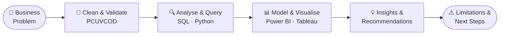
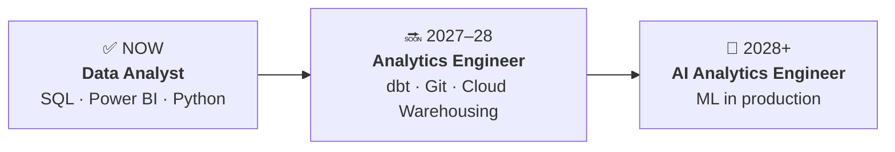

<!-- ============================================================
     GitHub Profile README · Ahmed Al Rafsan
     Paste into: github.com/Ahmed-Al-Rafsan/Ahmed-Al-Rafsan → README.md
     ============================================================ -->

<div align="center">


<br/>

[](https://ahmed-al-rafsan.github.io)
[](https://www.linkedin.com/in/ahmed-al-rafsan-)
[](https://www.youtube.com/@AhmedAlRafsan)
[](mailto:ahmed.rafsan108@gmail.com)


<br/><br/>

> 💼 **Open to:** Junior Data Analyst · Reporting Analyst · Insights Analyst · People/HR Analytics — **Melbourne, Australia**
>
> 🌐 **Full portfolio, project writeups & blog:** [ahmed-al-rafsan.github.io](https://ahmed-al-rafsan.github.io)

</div>

---

## 🧭 About Me

I turn messy, raw data into **decision-ready insights** — and I present them the way stakeholders actually consume them. I don't just build dashboards; I find the **business story behind the numbers** and turn it into **recommendations people can act on**.

My path is a deliberate stack: **Aeronautical Engineering** (systems thinking) → **MBA in HRM** (people & business logic) → **Master of Business Information Systems, Data Analytics** (the technical core). Before moving into analytics full-time, I owned the enterprise performance-reporting cycle for **500+ employees** at Kazi Farms Group, reporting directly to CEO and GM level — so I learned to speak *stakeholder* before I learned DAX.

Most recently: a **live six-month industry capstone** as **Team Lead & Data Analyst** for a real Australian client — a national school-targeting ML pipeline, a Top-200 outreach list delivered into the client's CRM, and an executive Power BI dashboard, handed over end-to-end.

```python
class DataAnalyst:
    def __init__(self):
        self.name         = "Ahmed Al Rafsan"
        self.based_in     = "Melbourne, Australia 🇦🇺"
        self.role         = "Data Analyst — Workforce & Business Analytics"
        self.education    = ["MBIS (Data Analytics) — completing 2026",
                             "MBA (Human Resource Management)",
                             "BEng Aeronautical Engineering"]
        self.daily_stack  = ["SQL", "Power BI + DAX", "Python (pandas, scikit-learn)",
                             "Excel + Power Query", "Tableau"]
        self.edge         = "3 domains × 3 countries — engineering rigour + HR stakeholder logic + data"
        self.now_pursuing = ["Microsoft PL-300", "Azure DP-900"]
        self.portfolio    = "https://ahmed-al-rafsan.github.io"

    def mission(self):
        return "Turn messy data into decisions people can defend in a boardroom."
```

---

## 🔁 How I Work

Every project follows the same logic — it leads with the **business question**, never the tool:



**PCUVCOD** — my data-cleaning framework: **P**rofile → **C**ompleteness → **U**niqueness → **V**alidity → **C**onsistency → **O**utliers → **D**ocument. Seven checks, same order, every dataset, no exceptions.

---

## 🛠️ Tech Stack

<div align="center">

| | |
|---:|:---|
| **Languages & Querying** |    |
| **BI & Visualisation** |      |
| **Analysis & ML** |     |
| **Workflow & AI** |      |
| **Exploring Next** |    |

</div>

---

## 🚀 Featured Projects

<table>
<tr>
<td colspan="2">

### 🏫 Australian Schools Priority Targeting Model &nbsp;⭐ *Flagship — live industry capstone*

`Python` · `scikit-learn` · `K-Means` · `Random Forest` · `Power BI`

**Team Lead & Data Analyst** on a six-month engagement for a **real Australian small-business client.** Led a **6-person cross-functional team** end-to-end — from raw government data through to live client handover. Architected the full Python ML pipeline on a **9,855-school national dataset**: cleaning, feature engineering, a custom Priority Score, **K-Means segmentation (k=4)**, and a **Random Forest classifier (AUC 0.972)** on the held-out test set. Deliberately excluded the target-correlated feature from model inputs to **prevent data leakage** — a design choice that made the priority logic independently defensible at handover. Delivered **3,344 high-priority schools identified**, an operational **Top-200 outreach list** ingested directly into the client's CRM, and a 2-page executive Power BI dashboard.

> 🧭 Real client · Real data · Real handover

[](https://github.com/Ahmed-Al-Rafsan/schools-priority-segmentation-capstone)

</td>
</tr>
<tr>
<td width="50%">

### 🧑‍💼 HR Employee Attrition Predictor

`Python` · `MySQL` · `Power BI` · `ML`

Paired **hands-on HR domain experience** with machine learning to predict turnover across **1,470 employee records**. Logistic Regression + Random Forest with balanced class weights, **11 SQL business queries**, and a 2-page Power BI dashboard with **8 custom DAX measures** scoring every employee into a **High / Medium / Low risk tier** — 344 employees flagged for HR action.

[](https://github.com/Ahmed-Al-Rafsan/HR-Employee-Attrition-Predictor) [](https://youtu.be/V1bS9olSKx8)

</td>
<td width="50%">

### 🛒 Customer Segmentation & RFM Analysis

`Python` · `MySQL` · `Power BI`

Analysed **1M+ UK online-retail transactions** through a **7-script pipeline** (1.07M rows cleaned to 805K) and an RFM scoring system classifying **5,878 customers into 7 behavioural segments** — surfacing a **177× Customer Lifetime Value gap**. Headline finding: **75–80% of new customers churn within the first month** — onboarding is the single highest-leverage retention fix.

[](https://github.com/Ahmed-Al-Rafsan/Customer-Segmentation-RFM-Analysis) [](https://youtu.be/27dancSDNOo)

</td>
</tr>
<tr>
<td width="50%">

### 👗 Fashion Retail Intelligence

`Python` · `MySQL` · `Power BI`

Root-cause investigation of an **89% revenue decline** across 24 months of sales data. **10 SQL queries** (GROUP BY, HAVING, LAG) traced the collapse to **92% of customers going inactive** — with the top customer, worth **12.7% of total revenue**, going dormant. Delivered **4 executive recovery recommendations** via a 4-page dashboard.

[](https://github.com/Ahmed-Al-Rafsan/Fashion-Retail-Intelligence) [](https://youtu.be/Y8TWx8vikOE)

</td>
<td width="50%">

### 🏙️ Melbourne CBD Business Analysis

`Python` · `Power BI`

Explored **20+ years of Victorian Government open data** — identified **45% growth** in CBD business establishments and flagged vacant-space trends as a forward operational-risk indicator for the city's recovery story.

[](https://github.com/Ahmed-Al-Rafsan/melbourne-cbd-business-analysis)

</td>
</tr>
</table>

---

## 🏢 Industry Job Simulations — Forage (all completed, 2026)

<table>
<tr>
<td width="33%" valign="top">

### 🟢 Quantium — Data Analytics

`Retail Analytics` · `Python` · `pandas`

Analysed **260k+ chip transactions**, segmented customers by lifestage × premium tier, evaluated trial-store layout uplift across 3 locations.

[](https://github.com/Ahmed-Al-Rafsan/quantium-retail-analytics)

</td>
<td width="33%" valign="top">

### 🟡 Commonwealth Bank — Intro to Data Science

`Banking` · `Excel` · `Privacy` · `SQL`

Conditional aggregation on **50k+ records**, **PII anonymisation aligned with the Australian Privacy Act**, and a 5-table relational schema designed in **3NF**.

[](https://github.com/Ahmed-Al-Rafsan/commbank-data-science-simulation)

</td>
<td width="33%" valign="top">

### 🟣 Deloitte Australia — Data Analytics

`Consulting` · `Tableau` · `Forensics`

Tableau dashboard for factory-telemetry downtime analysis (**160k+ IoT records across 4 factories**) and a forensic pay-equity classification for an HR audit.

[](https://github.com/Ahmed-Al-Rafsan/deloitte-forensic-analytics)

</td>
</tr>
</table>

---

## 🎓 Certifications & Education

- [x] 🎓 **Google Advanced Data Analytics Professional Certificate** — Coursera, 2026
- [x] 🎓 **IBM Data Analyst Professional Certificate** — Coursera, 2026
- [x] 📊 **Creative Designing in Power BI** — Microsoft / Coursera, 2026
- [x] 🏢 **3 × Forage industry simulations** — Quantium · Commonwealth Bank · Deloitte Australia, 2026
- [ ] 📊 **Microsoft PL-300 — Power BI Data Analyst** — *in progress*
- [ ] ☁️ **Microsoft DP-900 — Azure Data Fundamentals** — *in progress*

**Education:** Master of Business Information Systems (Data Analytics) — AIH Melbourne, *completing 2026* · MBA (HRM) — North South University, 2019–2021 · BEng Aeronautical Engineering — Nanchang Hangkong University, 2014–2018

---

## 🎯 Career Roadmap



---

## 📊 GitHub Analytics

<div align="center">


<br/><br/>


<br/><br/>


</div>

---

## 🎥 Project Walkthroughs on YouTube

Every major project ships with a **stakeholder-style walkthrough** — findings presented the way an analyst presents to a business meeting, not a code tutorial.

<div align="center">

[](https://www.youtube.com/@AhmedAlRafsan)

</div>

---

<div align="center">

*"Data analysis isn't about making charts. It's about finding the story behind the numbers and turning it into business decisions."*

📍 Melbourne, Australia · 🎓 MBIS (Data Analytics), AIH · 🌐 [ahmed-al-rafsan.github.io](https://ahmed-al-rafsan.github.io) · 📧 [ahmed.rafsan108@gmail.com](mailto:ahmed.rafsan108@gmail.com)


</div>
