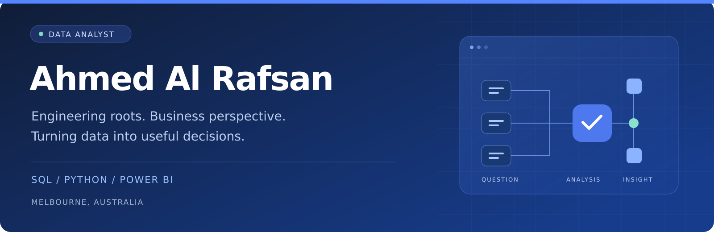

 

**[Portfolio & writing](https://ahmed-al-rafsan.github.io/) · [LinkedIn](https://www.linkedin.com/in/ahmed-al-rafsan-/) · [Project walkthroughs](https://www.youtube.com/@AhmedAlRafsan) · [Email](mailto:ahmed.rafsan108@gmail.com)**

Melbourne, Australia · Open to data, reporting and business analytics opportunities

---

## From a business question to a useful answer

I'm Rafsan, a **Data Analyst with an aeronautical engineering background and experience in HR reporting**. I work with SQL, Python and Power BI to explore data, explain patterns and turn findings into practical recommendations.

My experience spans KPI reporting for **500+ employees** at Kazi Farms Group and leading a **six-person industry capstone team** at the Australian Institute of Higher Education. I completed my **Master of Business Information Systems (Data Analytics) in July 2026**.

This profile brings together the code, analysis and walkthroughs behind my portfolio. My next technical focus is making analytical work easier to reproduce, test and maintain.

## Start here

### 01 / Australian schools priority targeting

**Industry capstone · Team Lead & Data Analyst**

Which schools should a small Australian business approach first? Our engagement covered **9,855 schools**, combining a transparent priority score, K-Means segmentation and a CRM-ready outreach list. I led the team and the analytics workstream, with an executive Power BI dashboard among the deliverables.

**Technical decision:** the Random Forest inputs exclude the variable used to define the high-priority label. The project reports a held-out **ROC-AUC of 0.972** on the original dataset. This measures recovery of that priority label; it does **not** establish sales conversion or validate the business value of the scoring rule.

**Public evidence:** Python analysis, methodology and a synthetic demonstration dataset. The original client data and client dashboard remain private; the reported engagement metric is not a benchmark for the synthetic demo.

`Python` `pandas` `scikit-learn` `K-Means` `Random Forest` `Power BI`

**[Explore the project →](https://github.com/Ahmed-Al-Rafsan/schools-priority-segmentation-analysis)** · [Read the analysis code](https://github.com/Ahmed-Al-Rafsan/schools-priority-segmentation-analysis/blob/main/analysis/priority_scoring_analysis.py) · [Methodology](https://github.com/Ahmed-Al-Rafsan/schools-priority-segmentation-analysis/blob/main/docs/methodology.md)

### 02 / Customer segmentation & retention

**Independent portfolio project · Python → MySQL → Power BI**

An analysis of **1M+ retail transaction rows** using RFM scoring and cohort analysis. The project documents **5,878 customers across seven segments**, with scripts for cleaning, exploration, segmentation and database loading.

**Explore for:** the progression from transaction-level data to customer-level measures and a three-page dashboard. This is an analytical portfolio study; recommendations are not measured commercial outcomes.

`Python` `pandas` `MySQL` `RFM` `Cohort analysis` `Power BI`

**[Explore the project →](https://github.com/Ahmed-Al-Rafsan/Customer-Segmentation-RFM-Analysis)** · [Python scripts](https://github.com/Ahmed-Al-Rafsan/Customer-Segmentation-RFM-Analysis/tree/main/python) · [Watch the walkthrough](https://youtu.be/27dancSDNOo)

### 03 / HR employee attrition

**Independent portfolio project · People analytics & classification**

A portfolio study using the **1,470-row IBM HR attrition dataset**, combining Logistic Regression and Random Forest models, **11 SQL business queries**, and a two-page Power BI dashboard. My HR background informs the questions and the way I present the findings.

**Explore for:** the connection between model outputs, SQL analysis and stakeholder reporting. The resulting scores are demonstrations, not a deployed employee decision system.

`Python` `scikit-learn` `MySQL` `DAX` `Power BI`

**[Explore the project →](https://github.com/Ahmed-Al-Rafsan/HR-Employee-Attrition-Predictor)** · [SQL analysis](https://github.com/Ahmed-Al-Rafsan/HR-Employee-Attrition-Predictor/blob/main/p4_HR_Attrition_Project.sql) · [Watch the walkthrough](https://youtu.be/V1bS9olSKx8)

<strong>More projects & practical exercises</strong>

 

| Project | Focus |
| :--- | :--- |
| [Fashion Retail Intelligence](https://github.com/Ahmed-Al-Rafsan/Fashion-Retail-Intelligence) | Revenue trends, customer activity, SQL and Power BI |
| [Melbourne CBD Business Analysis](https://github.com/Ahmed-Al-Rafsan/melbourne-cbd-business-analysis) | Government open data, business trends and dashboarding |
| [Quantium retail analytics](https://github.com/Ahmed-Al-Rafsan/quantium-retail-analytics) | Customer segments and trial-store analysis — Forage simulation |
| [Commonwealth Bank data science](https://github.com/Ahmed-Al-Rafsan/commbank-data-science-simulation) | Aggregation, anonymisation and database design — Forage simulation |
| [Deloitte forensic analytics](https://github.com/Ahmed-Al-Rafsan/deloitte-forensic-analytics) | Tableau telemetry analysis and pay-equity classification — Forage simulation |

The Forage projects are learning simulations, not employment with those organisations.

## Technical toolkit

| Area | Tools used in my analytical work |
| :--- | :--- |
| Querying & transformation | SQL, MySQL, Python, pandas, NumPy |
| Business intelligence | Power BI, DAX, Power Query, Excel, Tableau |
| Statistical & machine learning analysis | scikit-learn, classification, clustering, exploratory analysis |
| Development & communication | Jupyter, Git/GitHub, technical documentation, video walkthroughs |

**Developing next:** stronger Python and SQL foundations, reproducible pipelines, automated data-quality checks, dbt and data-engineering fundamentals.

**Long-term interest:** applying data analysis and machine learning to aerospace problems, building on my engineering education.

## How I approach the work

- **Define the decision.** Start with the question, audience and meaning of each metric.
- **Examine the data.** Check completeness, uniqueness, validity, consistency and outliers; document treatment choices.
- **Explain the reasoning.** Make methods, assumptions and limitations visible alongside the results.
- **Make the handover useful.** Connect code and analysis to clear documentation, dashboards and next actions.

<strong>Education & professional learning</strong>

 

- **Master of Business Information Systems (Data Analytics)** — Australian Institute of Higher Education; completed July 2026.
- **MBA in Human Resource Management** — North South University.
- **Bachelor of Engineering in Aircraft Design & Engineering** — Nanchang Hangkong University.
- **Google Advanced Data Analytics Professional Certificate** — Coursera.
- **IBM Data Analyst Professional Certificate** — Coursera.
- **Creative Designing in Power BI** — Microsoft / Coursera.

---

**Let's connect.** I'm interested in work where careful analysis, business understanding and clear communication make a difference.

[Portfolio](https://ahmed-al-rafsan.github.io/) · [LinkedIn](https://www.linkedin.com/in/ahmed-al-rafsan-/) · [YouTube](https://www.youtube.com/@AhmedAlRafsan) · [ahmed.rafsan108@gmail.com](mailto:ahmed.rafsan108@gmail.com)
