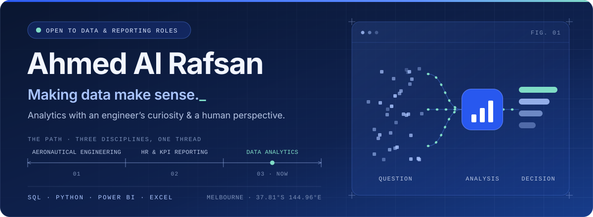
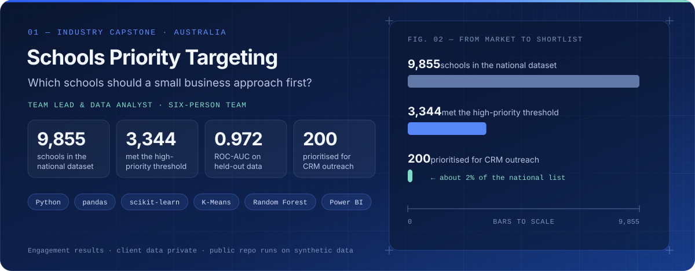
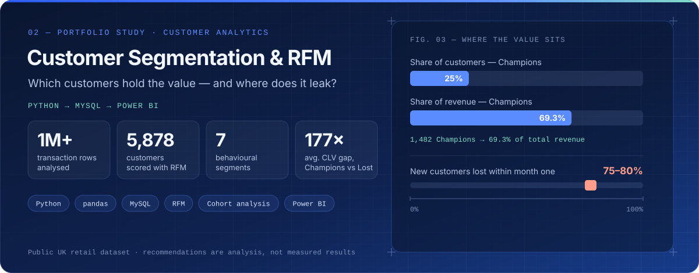
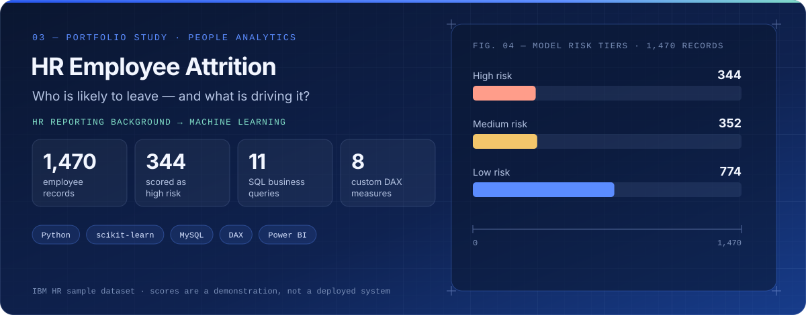
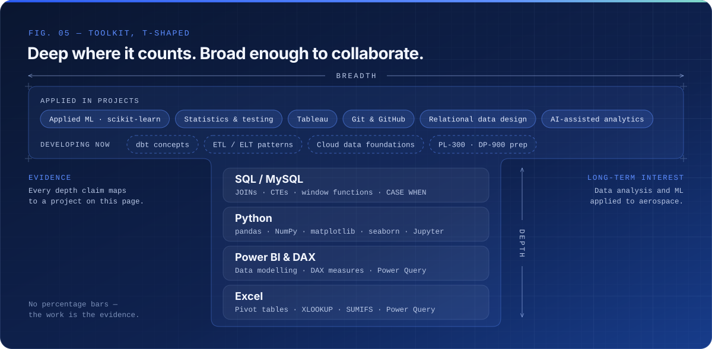
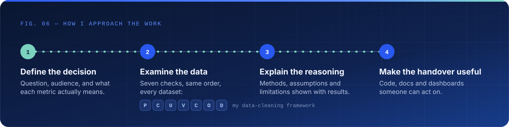

&nbsp;
&nbsp;
&nbsp;

Melbourne, Australia · Open to data, reporting and business analytics roles

## From a business question to a useful answer

I'm Rafsan, a **data analyst with an aeronautical engineering degree and a background in HR reporting**. I work in SQL, Python and Power BI to explore data, explain what is driving a pattern, and turn the findings into recommendations someone can act on.

Before analytics, I owned KPI reporting and performance evaluation for **500+ employees** at Kazi Farms Group, reporting to CEO and GM level. More recently I led a **six-person industry capstone team** at the Australian Institute of Higher Education, where I completed my **Master of Business Information Systems (Data Analytics)** in 2026.

This profile holds the code, analysis and walkthroughs behind my portfolio. My next technical focus is making analytical work easier to reproduce, test and maintain.

## Start here

**The question.** A small Australian business was approaching a national list of schools one by one, with no targeting logic. Which schools should it approach first?

**What I did.** Led the team and the analytics workstream: merged and cleaned eight state and territory files, built a transparent priority score the client can read and challenge, segmented the market with K-Means (k = 4), and used a Random Forest to test whether the priority pattern holds up. The deliverables included a CRM-ready Top 200 outreach list and a two-page Power BI executive dashboard.

**The decision I'd defend.** The high-priority label is derived from a single variable, so that variable is excluded from the Random Forest inputs — otherwise the model would simply look up the answer. The held-out **ROC-AUC of 0.972** measures how well the label is recovered from the rest of the school profile. It does **not** measure sales conversion.

**[Explore the project →](https://github.com/Ahmed-Al-Rafsan/schools-priority-segmentation-analysis)** &nbsp;·&nbsp; [Analysis code](https://github.com/Ahmed-Al-Rafsan/schools-priority-segmentation-analysis/blob/main/analysis/priority_scoring_analysis.py) &nbsp;·&nbsp; [Methodology](https://github.com/Ahmed-Al-Rafsan/schools-priority-segmentation-analysis/blob/main/docs/methodology.md)

The client's data and dashboard stay private. The repository runs end to end on a synthetic demo dataset; the engagement metrics above are not a benchmark for that demo.

 

**The question.** In a UK online retailer's transactions, which customers hold the value — and where is it leaking?

**What I did.** A seven-script Python pipeline cleaned 1,067,371 rows down to 805,549, scored 5,878 customers with RFM and grouped them into seven behavioural segments, with cohort retention and lifetime-value analysis alongside. Eight SQL queries in MySQL and a three-page Power BI dashboard carry the findings.

**What it found.** 1,482 Champions — a quarter of customers — account for 69.3% of revenue, while 75–80% of new customers are lost within their first month, which points at onboarding.

**[Explore the project →](https://github.com/Ahmed-Al-Rafsan/Customer-Segmentation-RFM-Analysis)** &nbsp;·&nbsp; [Python scripts](https://github.com/Ahmed-Al-Rafsan/Customer-Segmentation-RFM-Analysis/tree/main/python) &nbsp;·&nbsp; [SQL](https://github.com/Ahmed-Al-Rafsan/Customer-Segmentation-RFM-Analysis/tree/main/SQL) &nbsp;·&nbsp; [Watch the walkthrough](https://youtu.be/27dancSDNOo)

An analytical portfolio study on public data. The recommendations are analysis, not measured commercial outcomes.

 

**The question.** Which employees are most likely to leave, and what is driving it?

**What I did.** Logistic Regression and Random Forest models with balanced class weights on the 1,470-row IBM HR attrition dataset, prioritising recall on the leaver class over raw accuracy. Eleven SQL business queries and a two-page Power BI dashboard with eight DAX measures connect the model to stakeholder reporting. My HR background shaped the questions and how the findings are presented.

**[Explore the project →](https://github.com/Ahmed-Al-Rafsan/HR-Employee-Attrition-Predictor)** &nbsp;·&nbsp; [SQL analysis](https://github.com/Ahmed-Al-Rafsan/HR-Employee-Attrition-Predictor/blob/main/p4_HR_Attrition_Project.sql) &nbsp;·&nbsp; [Notebook](https://github.com/Ahmed-Al-Rafsan/HR-Employee-Attrition-Predictor/blob/main/P4_HR_Attrition_Predictor.ipynb) &nbsp;·&nbsp; [Watch the walkthrough](https://youtu.be/V1bS9olSKx8)

Scores are a demonstration on a public sample dataset, not a deployed decision system.

<strong>More projects and job simulations</strong>

 

| Project | Focus | Type |
| :--- | :--- | :--- |
| [Fashion Retail Intelligence](https://github.com/Ahmed-Al-Rafsan/Fashion-Retail-Intelligence) | Root cause of an 89% revenue decline · SQL, Power BI | Portfolio project |
| [Melbourne CBD Business Analysis](https://github.com/Ahmed-Al-Rafsan/melbourne-cbd-business-analysis) | 20+ years of Victorian Government open data · Python, Power BI | Portfolio project |
| [Quantium retail analytics](https://github.com/Ahmed-Al-Rafsan/quantium-retail-analytics) | Customer segments and trial-store uplift | Forage simulation |
| [Commonwealth Bank data science](https://github.com/Ahmed-Al-Rafsan/commbank-data-science-simulation) | Aggregation, anonymisation and 3NF schema design | Forage simulation |
| [Deloitte forensic analytics](https://github.com/Ahmed-Al-Rafsan/deloitte-forensic-analytics) | Tableau telemetry dashboard and pay-equity classification | Forage simulation |

The Forage projects are learning simulations, not employment with those organisations.

## Toolkit

**Developing next:** stronger Python and SQL foundations, reproducible pipelines, automated data-quality checks, dbt and data-engineering fundamentals.

**Long-term interest:** applying data analysis and machine learning to aerospace problems, building on my engineering education.

## How I approach the work

<strong>Education and professional learning</strong>

 

- **Master of Business Information Systems (Data Analytics)** — Australian Institute of Higher Education, Melbourne · completed 2026
- **MBA in Human Resource Management** — North South University
- **Bachelor of Engineering, Aircraft Design & Engineering** — Nanchang Hangkong University, China
- **Google Advanced Data Analytics Professional Certificate** — Coursera
- **IBM Data Analyst Professional Certificate** — Coursera
- **Creative Designing in Power BI** — Microsoft / Coursera
- **Microsoft PL-300 and DP-900** — preparation in progress

 

<picture>
  <source media="(prefers-color-scheme: dark)" srcset="https://raw.githubusercontent.com/Ahmed-Al-Rafsan/Ahmed-Al-Rafsan/output/github-snake-dark.svg" />
  <source media="(prefers-color-scheme: light)" srcset="https://raw.githubusercontent.com/Ahmed-Al-Rafsan/Ahmed-Al-Rafsan/output/github-snake.svg" />
  
</picture>

**Let's connect.** I'm interested in work where careful analysis, business understanding and clear communication make a difference.

[Portfolio](https://ahmed-al-rafsan.github.io/) · [LinkedIn](https://www.linkedin.com/in/ahmed-al-rafsan-/) · [YouTube](https://www.youtube.com/@AhmedAlRafsan) · [ahmed.rafsan108@gmail.com](mailto:ahmed.rafsan108@gmail.com)

